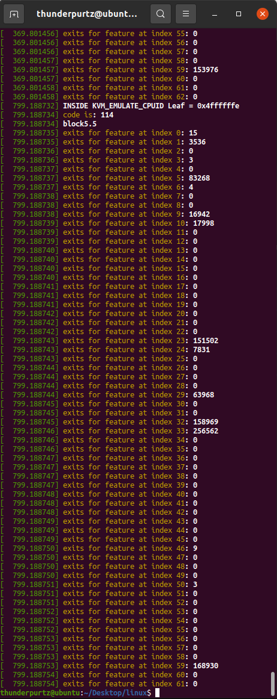
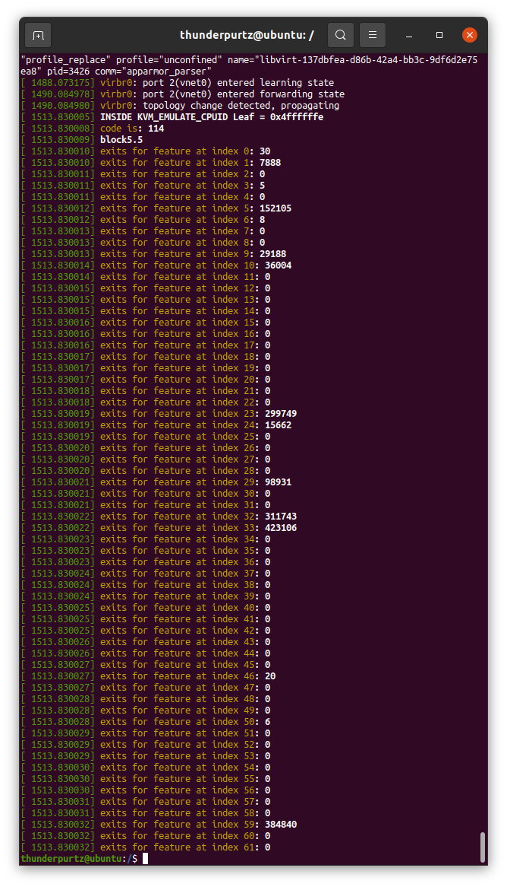

# Assignment 4:

### Q1:
All parts done by me alone.

### Q2:
With EPT:  

Without EPT:  

### Q3:
The count was what I expected. amd-v/rvi is amd's brand of nested paging, which uses less exits. 

### Q4:
As we learned in class, shadow paging utilizes many more exits than nested paging does. In this case I saw almost 2-3x more exits in the non ept version (shadow paging) than the ept version (nested paging). 

# Assignment 3:

### Q1:
All parts done by me alone. 

### Q2:
1. Finished up files from assignment 2 to use in assignment 3.
2. Pull up AMD developer manual to get intercept codes 
3. Edited cpuid.c and svm.c files in the kvm folders to generate assignment output
4. Recompiled modules with 'make modules M=arch/x86/kvm/
5. Manually moved module files into my kernel's module location using the following commands:

cp arch/x86/kvm/kvm.ko /lib/modules/5.9.0/kernel/arch/x86/kvm/kvm.ko
cp arch/x86/kvm/kvm-amd.ko /lib/modules/5.9.0/kernel/arch/x86/kvm/kvm-amd.ko

For some reason, removing and inserting new modules using rmmod and insmod did not have the intended affect. The kernel was continuing to utilize the old module for some reason. 
6. Test output with my test file.
7. Check dmesg in outer VM to get exit outputs. 

### Q3: 
The number of exits does seem to increase at a steady rate. Certain exit types do occur much more frequently.

### Q4:
Of the exit types defined in the AMD Manual, it seems that VMEXIT_NPF (hex code: 400, index 59 in my array) gets called most frequently. Other exits called frequently were VMEXIT_IOIO (hex code: 7b, index 32) and VMEXIT_MSR (hex code: 7c, index 33). Besides the any exits that have 0 count, exit type "VMEXIT_CR[0–15]_READ" (hex code: 0-F) and "VMEXIT_DR[0–15]_WRITE" (hex code: 30-3F) were called very infrequently (< 20 times).

# Assignment 2:

### Q1: 

Did it myself, didn't finish.

### Q2:
1. Downloaded Linux Kernel from Github onto local machine.
2. Installed dependencies required for making/compiling linux kernel.
3. Compiled Linux Kernel
4. Attempted to code solution to problem.
5. Attempted to set up a VM via KVM/QEMU/virsh. 
6. Sometimes things don't always work out. 

# Assignment 1:

### Q1:

Did it myself.

### Q2:

1. Enabled SVM Mode (AMD) in BIOS
2. Installed VMWare Workstation Player 16 on my Windows machine
3. Downloaded Ubuntu 20.04 LTS ISO from Ubuntu website
4. Created VM using VMWare and Ubuntu per instructions
5. Installed gcc, make, vim, Sublime on machine
6. Finished .c file to return full CPU capabilities and revision number (referenced AMD Programmer Reference Guide Vol. 3 Appendix)
7. Compiled and tested module on VM
8. Fork and clone linux repo from torvalds/linux.git (only latest commit to reduce size)
9. Add assignment folder (assignment1) to repo and add README.md
10. Finish README.md and push to repo
